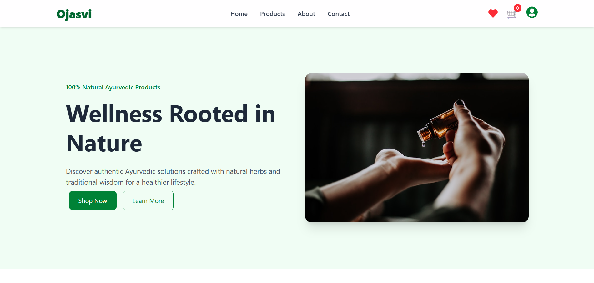
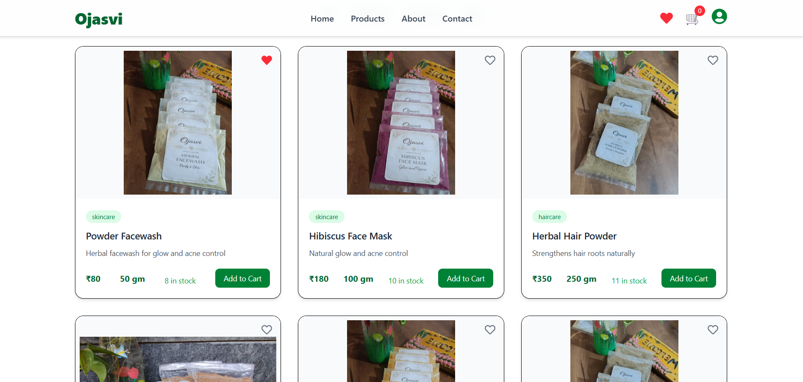
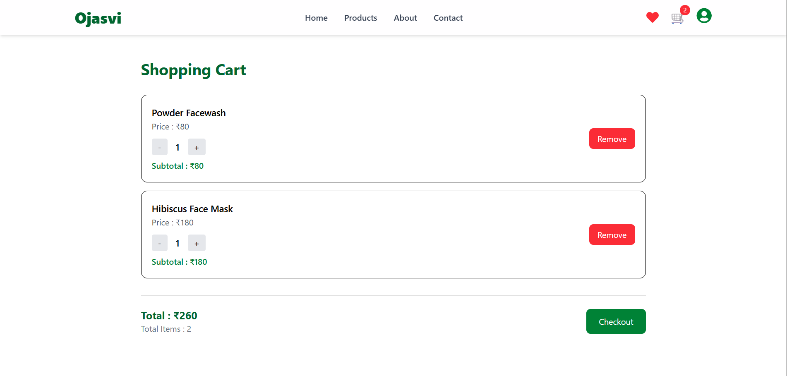
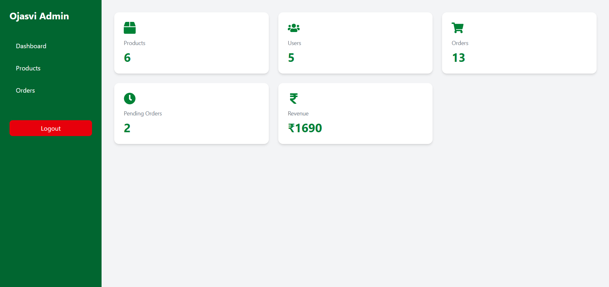

# 🌿 Ojasvi – Ayurvedic E-commerce Website


A full-stack **MERN-based Ayurvedic E-commerce Website** that allows users to browse Ayurvedic products, manage their cart and wishlist, place orders, and enables administrators to manage products, inventory, and customer orders through a secure dashboard.

---

# 🚀 Live Demo

### 🌐 Frontend
https://ojasvi-frontend.onrender.com

### 🔗 Backend API
https://ojasvi-backend.onrender.com

---

# 📖 About

Ojasvi is a modern Ayurvedic E-commerce application built using the **MERN Stack**.

It provides a seamless shopping experience where users can browse products, add them to their cart or wishlist, place orders, and manage their purchases.

The admin panel enables complete inventory management, product management, and order tracking with automatic stock updates.

---

# ✨ Key Features

## 👤 User Features

- User Registration
- Secure Login
- JWT Authentication
- Protected Routes
- Browse Products
- Product Filtering
- Shopping Cart
- Wishlist
- Increase / Decrease Cart Quantity
- Place Orders
- View Order History
- Cancel Orders

---

## 👨‍💼 Admin Features

- Secure Admin Login
- Admin Dashboard
- Add Products
- Edit Products
- Delete Products
- Manage Customer Orders
- Update Order Status
- Inventory Management

---

## 📦 Inventory Management

- Product stock decreases automatically after successful order placement.
- Product stock restores automatically when an order is cancelled.
- Prevents overselling by maintaining real-time inventory.

---

# 🛠 Tech Stack

## Frontend

- React.js
- Tailwind CSS
- React Router
- Context API
- Axios

## Backend

- Node.js
- Express.js
- REST APIs
- JWT Authentication

## Database

- MongoDB Atlas
- Mongoose

## Deployment

- Render
- GitHub

---

# 📂 Project Structure

```
ayurveda-business-site
│
├── client
│   ├── public
│   ├── src
│   └── package.json
│
├── server
│   ├── controllers
│   ├── middleware
│   ├── models
│   ├── routes
│   ├── server.js
│   └── package.json
│
├── screenshots
│
└── README.md
```

---

# ⚙ Installation

## Clone Repository

```bash
git clone https://github.com/DishaBhamare/ayurveda-business-site.git
```

---

## Backend Setup

```bash
cd server

npm install

npm start
```

---

## Frontend Setup

```bash
cd client

npm install

npm run dev
```

---

# 🔑 Environment Variables

Create a **.env** file inside the **server** folder.

```env
MONGO_URI=your_mongodb_connection_string
JWT_SECRET=your_secret_key
PORT=5000
```

---

# 📸 Screenshots

## 🏠 Home Page



---

## 🛍 Products Page



---

## 🛒 Shopping Cart



---

## 👨‍💼 Admin Dashboard



---

# 🎯 Future Improvements

- Online Payment Gateway Integration
- Product Reviews & Ratings
- Search & Sorting
- Coupons & Discounts
- Email Notifications
- AI-based Product Recommendations

---

# 👩‍💻 Developed By

## Disha Bhamare

📌 GitHub  
https://github.com/DishaBhamare

📌 LinkedIn  
https://www.linkedin.com/in/disha-bhamare-b066602aa

---

# ⭐ Support

If you found this project helpful, please consider giving this repository a **⭐ Star** on GitHub.

It motivates me to build more projects and continuously improve.

---

## 📄 License

This project is developed for educational and portfolio purposes.
